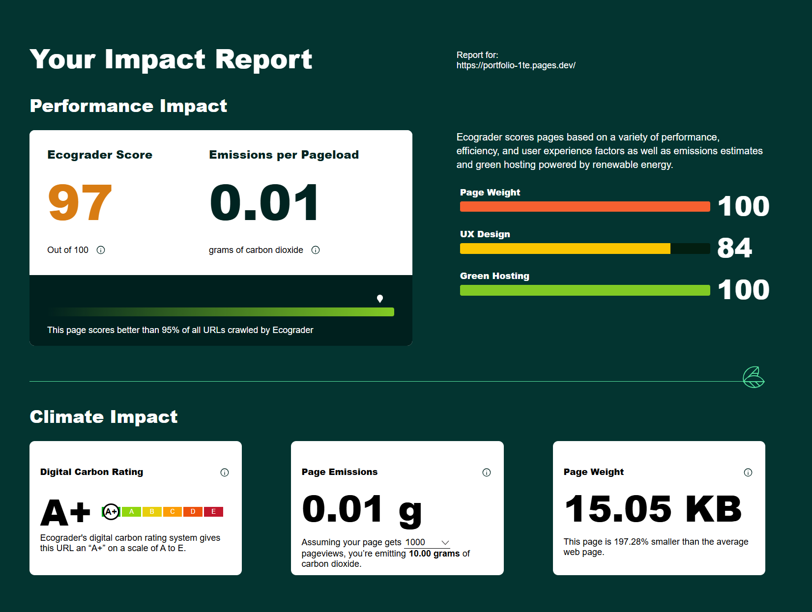

# Portfolio
## Gruppenarbeit Web-Engineering
made by:
Adrianna Kwiecinska
Patrick Schmutz
### Aufgabenstellung:
- https://github.com/fhirter/webengineering/blob/main/Assignments/01_Basics.md

### Abgaberelevant
#### CSS Validator
- https://jigsaw.w3.org/css-validator/validator?lang=de&profile=css3svg&uri=https%3A%2F%2Fportfolio-1te.pages.dev%2F&usermedium=all&vextwarning=&warning=2
- https://jigsaw.w3.org/css-validator/validator?uri=https%3A%2F%2Fportfolio-1te.pages.dev%2F&profile=css3svg&usermedium=all&warning=2&vextwarning=&lang=de

#### HTML Validator
- https://validator.w3.org/nu/?doc=https%3A%2F%2Fportfolio-1te.pages.dev%2F

#### Ecograder

#### Übersicht
Das Projekt wurde im Unterricht erstellt.
Hierfür wurde das ganze als HTML und CSS File aufgebaut und über GitHub automatisiert auf einem Host veröffentlicht.
In diesem Github finden Sie verschiedene Anläufe wie beispielsweise Docker, welches dann nicht weiterverfolgt wurde.

Die Abgaberelevanten Inhalte finden Sie zudem unter Doku:
- https://github.com/dasabnormale/Portfolio/tree/main/Doku
- 

#### Link
- https://portfolio-1te.pages.dev/

### Quellen/ Verwendetes Material
#### Verwendetes Unterrichtsmaterial:
- Buch: Fullstack-Entwicklung
Das Handbuch für Webentwickler
ISBN 978-3-8362-9085-2
- Unterrichtspowerpoint von Fabian Hirter auf Teamsablage. Diese wird nicht veröffentlicht daher nur ein Shoutout:
  https://fabianhirter.ch/

#### Navigation Bar
- https://www.youtube.com/watch?v=QwKM2Dubg44&

#### Flexboxtutorial
- https://flexboxfroggy.com/#de

#### KI
- https://chatgptcom
